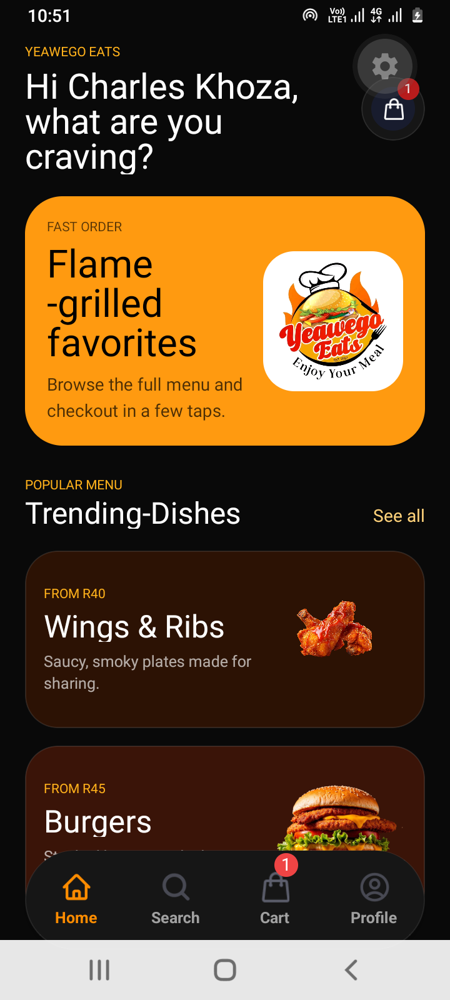
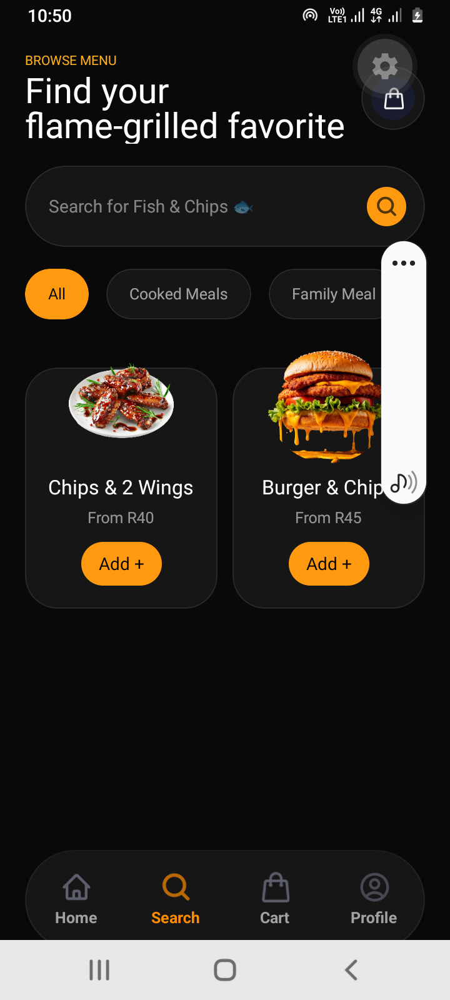

# 🍔 Yeawego Eats

A modern food ordering mobile application built with React Native, designed to provide users with a fast and seamless ordering experience for Android and iOS.

## 📱 Overview

Yeawego Eats allows customers to browse menu categories, search for meals, add items to their cart, and place orders through an intuitive mobile interface.

The application focuses on delivering a modern user experience with clean navigation, attractive food presentation, and efficient ordering workflows.

---

## ✨ Features

### Customer Features

- Browse food categories
- Search menu items
- View trending dishes
- Add items to cart
- Cart badge notifications
- User profile management
- Responsive mobile UI
- Dark mode interface
- Fast navigation experience

### Technical Features

- React Native mobile development
- Cross-platform support (Android & iOS)
- Component-based architecture
- Reusable UI components
- State management
- Custom navigation structure
- Optimized rendering
- Modern design system

---

## 📸 Screenshots

### Home Screen



The landing page displays featured menu items, trending dishes, and quick access to ordering options.

### Browse Menu



Users can search meals, filter categories, and add products directly to their cart.

---

## 🛠️ Tech Stack

### Frontend

- React Native
- JavaScript / TypeScript
- React Navigation

### State Management

- Context API / Zustand Toolkit

### Mobile Development

- Android
- iOS

### Development Tools

- Git
- GitHub
- VS Code

---

## 🏗️ Project Structure

src/
├── assets/
├── components/
├── navigation/
├── screens/
├── services/
├── hooks/
├── utils/
├── constants/
└── store/

---

## 🚀 Installation

Clone the repository:

```bash
git clone https://github.com/Khozacharles832/yeawego-eats.git
```

Navigate into the project:

```bash
cd yeawego-eats
```

Install dependencies:

```bash
npm install
```

Run Android:

```bash
npm run android
```

Run iOS:

```bash
npm run ios
```

---

## 🎯 Challenges Solved

- Building reusable food-card components
- Managing cart state efficiently
- Designing an intuitive food ordering flow
- Creating a scalable navigation structure
- Implementing a modern dark-themed UI

---

## 📈 Future Improvements

- User Authentication
- Firebase Integration
- Order Tracking
- Push Notifications
- Payment Gateway Integration
- Backend API Integration
- Favorites System
- Order History

---

## 💡 What I Learned

Through this project I strengthened my understanding of:

- React Native Architecture
- Mobile UI/UX Design
- Component Reusability
- Navigation Patterns
- State Management
- Performance Optimization
- Production-Ready Mobile Development

---

## 👨‍💻 Author

Charles Khoza

React Native Developer

LinkedIn: https://linkedin.com/in/charles-khoza-a7990a241

GitHub: https://github.com/Khozacharles832
